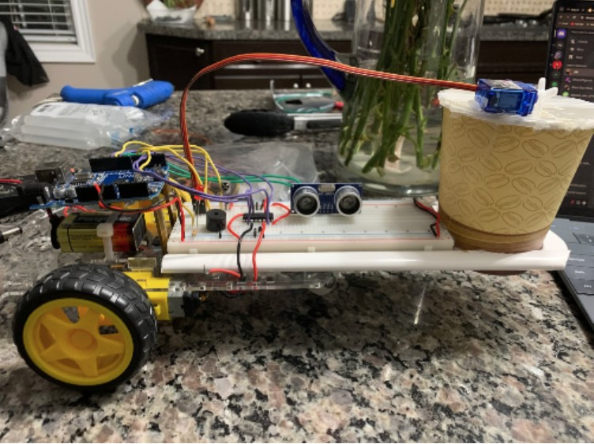
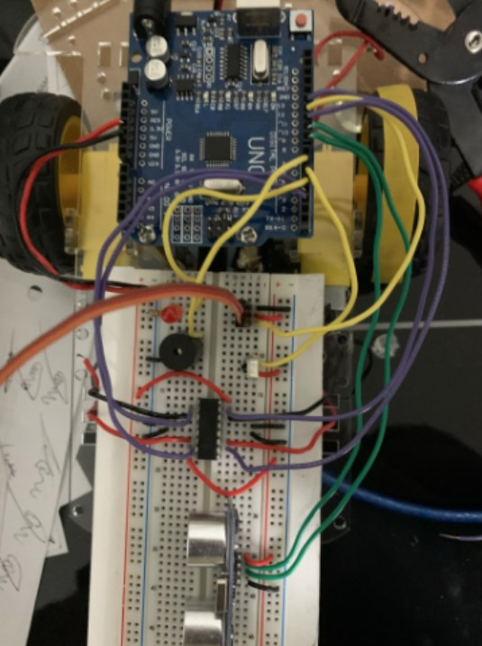
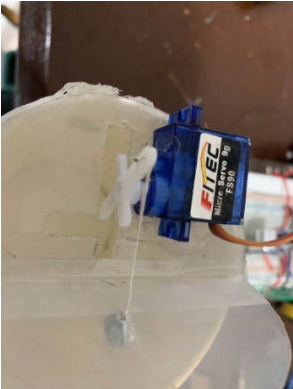
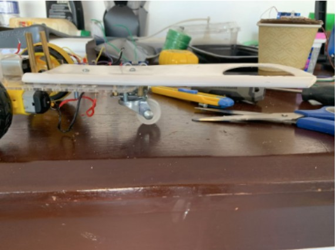

# arduino-smart-trash-can
# Movable Arduino Smart Trash Can

## Overview
This project is a movable smart trash can built using an Arduino Uno.  It can automatically open when detecting an object and can move using a remote control.

## Features
- Automatic lid opening
- Ultrasonic sensor detection
- Remote-controlled movement
- Servo motor lid mechanism
- LED + buzzer feedback

## Components
- Arduino Uno
- HC-SR04 Ultrasonic Sensor
- SG90 Servo Motor
- L293D Motor Driver
- DC Motors
- IR Receiver
- Breadboard
- LED
- Buzzer

## How It Works
The ultrasonic sensor detects nearby objects and opens the lid using a servo motor.  
The trash can can also move using an IR remote and DC motors.

## Images

## Arduino Code
[View Arduino Code](./sketch_SmartTrashCan_copy_20260525154323.ino)

## Future Improvements
- Mobile app control
- Voice assistant integration
- Obstacle avoidance
- Machine learning Integration

## Author
Muizz Talat
